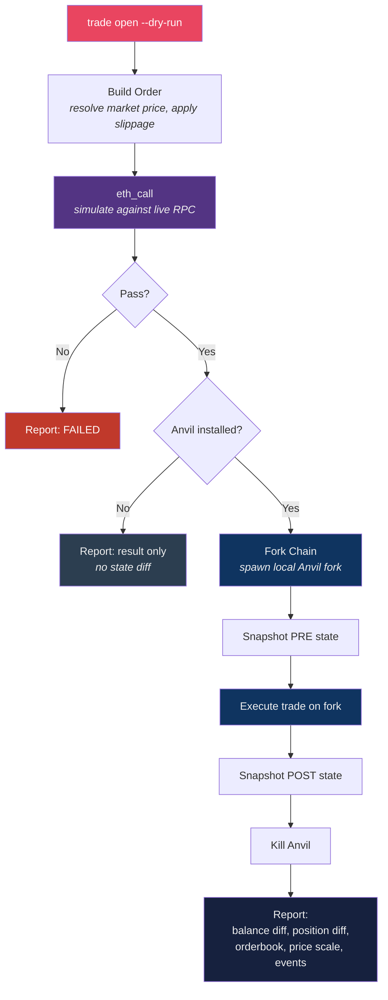

# Dry-Run Flow (Simplified)

```mermaid
flowchart TD
    A["trade open --dry-run"] --> B["Build Order<br/><i>resolve market price, apply slippage</i>"]

    B --> C["eth_call<br/><i>simulate against live RPC</i>"]
    C --> D{"Pass?"}
    D -- No --> R1["Report: FAILED"]

    D -- Yes --> E{"Anvil installed?"}
    E -- No --> R2["Report: result only<br/><i>no state diff</i>"]

    E -- Yes --> F["Fork Chain<br/><i>spawn local Anvil fork</i>"]
    F --> G["Snapshot PRE state"]
    G --> H["Execute trade on fork"]
    H --> I["Snapshot POST state"]
    I --> J["Kill Anvil"]

    J --> R3["Report:<br/>balance diff, position diff,<br/>orderbook, price scale, events"]

    style A fill:#e94560,color:#fff
    style C fill:#533483,color:#eee
    style F fill:#0f3460,color:#eee
    style H fill:#0f3460,color:#eee
    style R1 fill:#c0392b,color:#fff
    style R2 fill:#2c3e50,color:#eee
    style R3 fill:#16213e,color:#eee
```

The core idea in 3 steps: **validate** (eth_call) → **fork & execute** (Anvil) → **diff & report** (pre vs post state).
