# Dry-Run Flow Diagram

End-to-end flow when running:
```bash
npm run dev -- trade open --perp btc --side long --size 0.1 --price market --leverage 10 --dry-run
```

```mermaid
flowchart TD
    A["<b>npm run dev -- trade open</b><br/>--perp btc --side long --size 0.1<br/>--price market --leverage 10 --dry-run"] --> B

    subgraph CLI ["<b>CLI Layer</b> — src/cli/trade.ts"]
        B["Parse flags via Commander<br/><i>--perp, --side, --size, --price, --leverage, --dry-run</i>"]
        B --> C["loadEnvConfig()<br/><i>Read .env: RPC URL, private key, exchange address</i>"]
        C --> D["OwnerWallet.fromPrivateKey()<br/><i>Create viem PublicClient + WalletClient</i>"]
        D --> E["Exchange + HybridClient<br/><i>Wrapper for contract reads</i>"]
        E --> F["getPerpetualInfo(perpId=16)<br/><i>Fetch priceDecimals, lotDecimals from chain</i>"]
        F --> G["--price market detected<br/><i>Fetch mark price via getPosition()</i>"]
        G --> H["Apply 1% slippage<br/><i>markPrice × 1.01 = maxPrice</i>"]
        H --> I["Build OrderDesc<br/><i>pricePNS, lotLNS, leverageHdths, IOC=true</i>"]
        I --> J{"--dry-run flag?"}
        J -- "No" --> REAL["exchange.execOrder()<br/><i>Send real tx on-chain</i>"]
        J -- "Yes" --> K["simulateTrade(config, orderDesc)"]
    end

    subgraph SIM ["<b>Simulation Layer</b> — src/sdk/simulation/dry-run.ts"]
        K --> L

        subgraph STEP1 ["Step 1: eth_call (always runs)"]
            L["simulateContract()<br/><i>execOrder via eth_call against live RPC</i>"]
            L --> L2["estimateGas()<br/><i>Gas estimate (non-critical)</i>"]
            L2 --> L3["Return SimulateResult<br/><i>success, orderId, gasEstimate</i>"]
        end

        L3 --> M{"simulate.success<br/>AND anvil installed?"}
        M -- "No" --> RETURN["Return DryRunResult<br/><i>simulate only, no fork</i>"]

        M -- "Yes" --> N

        subgraph STEP2 ["Step 2: Anvil Fork Simulation"]
            N["startAnvilFork(rpcUrl)<br/><i>Spawn anvil --fork-url --port 0 --no-mining</i>"]
            N --> O["Create fork clients<br/><i>PublicClient + WalletClient → http://127.0.0.1:PORT</i>"]
            O --> P["snapshotAccount() — PRE<br/><i>getAccountByAddr, getPosition, getBalance</i>"]
            P --> Q["writeContract(execOrder)<br/><i>Execute trade on fork</i>"]
            Q --> R["evm_mine<br/><i>Mine the pending block</i>"]
            R --> S["waitForTransactionReceipt<br/><i>Get receipt + gas used</i>"]
            S --> T["snapshotAccount() — POST<br/><i>Same 3 queries, new state</i>"]
            T --> U["decodeLogs(receipt.logs)<br/><i>Decode events via ExchangeAbi</i>"]
            U --> V["getPerpetualInfo()<br/><i>Orderbook data from fork (non-critical)</i>"]
            V --> W["stopAnvil()<br/><i>SIGTERM the anvil process</i>"]
        end

        W --> RETURN2["Return DryRunResult<br/><i>simulate + fork (preState, postState, events, perpInfo)</i>"]
    end

    RETURN --> REPORT
    RETURN2 --> REPORT

    subgraph VIZ ["<b>Report Layer</b> — src/sdk/simulation/report.ts"]
        REPORT["printDryRunReport()"]
        REPORT --> V1["<b>Header</b><br/><i>DRY RUN + order details<br/>(market, type, size, price, leverage)</i>"]
        V1 --> V2["<b>Simulation Result</b><br/><i>SUCCESS/FAILED + orderId + gas est</i>"]
        V2 --> V3{"Fork available?"}
        V3 -- "No" --> V3B["Show 'Anvil not available' hint"]
        V3 -- "Yes" --> V4["<b>Gas Details</b><br/><i>gasUsed, gasPrice, gasCost</i>"]
        V4 --> V5["<b>Account Changes</b><br/><i>Balance: 15,505 → 14,809 USDC (-695)</i>"]
        V5 --> V6["<b>Balance Bar Chart</b><br/><i>██████████████████████████████<br/>█████████████████████████████░</i>"]
        V6 --> V7["<b>Position Changes</b><br/><i>Before: No position<br/>After: LONG 0.1 lots @ 69,336</i>"]
        V7 --> V8{"perpInfo available?"}
        V8 -- "No" --> V10
        V8 -- "Yes" --> V9A["<b>Mini Orderbook</b><br/><i>ASK/BID bars, spread %, fill price,<br/>open interest (LONG/SHORT)</i>"]
        V9A --> V9B["<b>Price Scale</b><br/><i>LIQ ├──────────┼──────┤ MARK<br/>distance to liq: 10.0%</i>"]
        V9B --> V10["<b>Events</b><br/><i>Decoded contract events</i>"]
        V10 --> V11["<b>Footer</b><br/><i>'run without --dry-run to execute'</i>"]
    end

    style CLI fill:#1a1a2e,stroke:#e94560,color:#eee
    style SIM fill:#0f3460,stroke:#e94560,color:#eee
    style VIZ fill:#16213e,stroke:#e94560,color:#eee
    style STEP1 fill:#1a1a3e,stroke:#533483,color:#eee
    style STEP2 fill:#1a1a3e,stroke:#533483,color:#eee
    style A fill:#e94560,stroke:#e94560,color:#fff
    style REAL fill:#333,stroke:#666,color:#999
```



## The 3 Layers

1. **CLI Layer** (`trade.ts`) — Parses args, fetches mark price from chain for `--price market`, applies slippage, builds the `OrderDesc` struct, then branches on `--dry-run`

2. **Simulation Layer** (`dry-run.ts`) — Two-step hybrid:
   - **Step 1** always runs `eth_call` against the live RPC (fast, no Anvil needed) to get pass/fail + gas estimate
   - **Step 2** only runs if Step 1 succeeds AND Anvil is installed: spawns a local Anvil fork, snapshots pre-state, executes the trade, mines the block, snapshots post-state, decodes events, fetches orderbook data, then kills Anvil

3. **Report Layer** (`report.ts`) — Renders everything to terminal with the 4 visualization types: colored text, balance bars, orderbook spread, and price scale diagram. Gracefully skips visualizations when data is missing.
